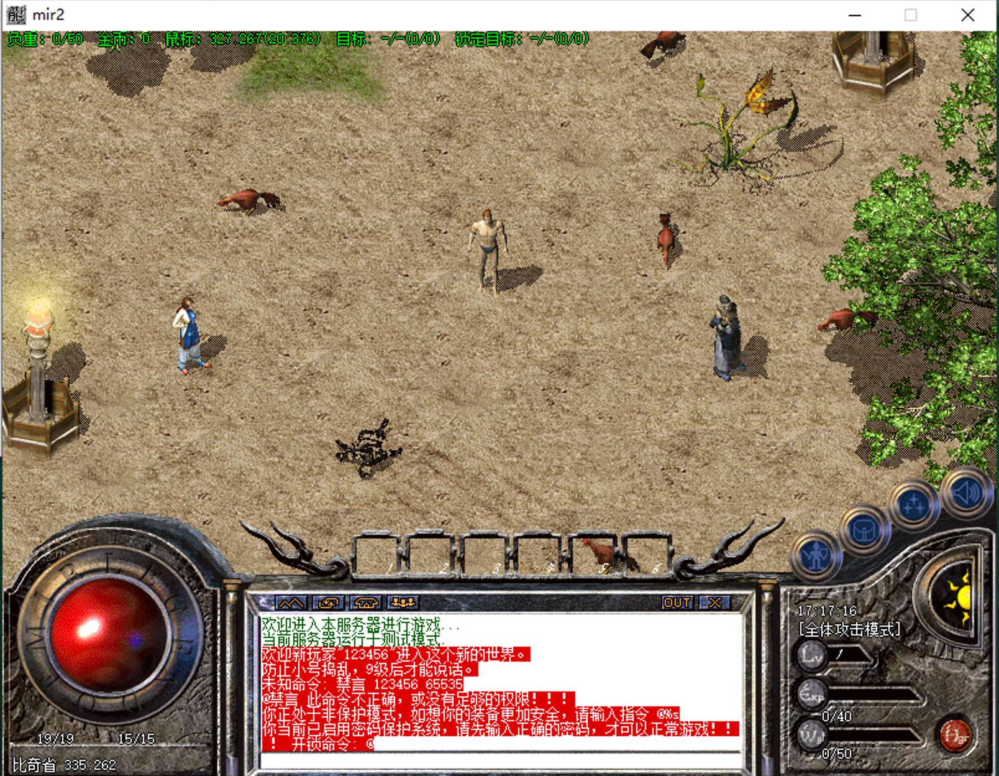
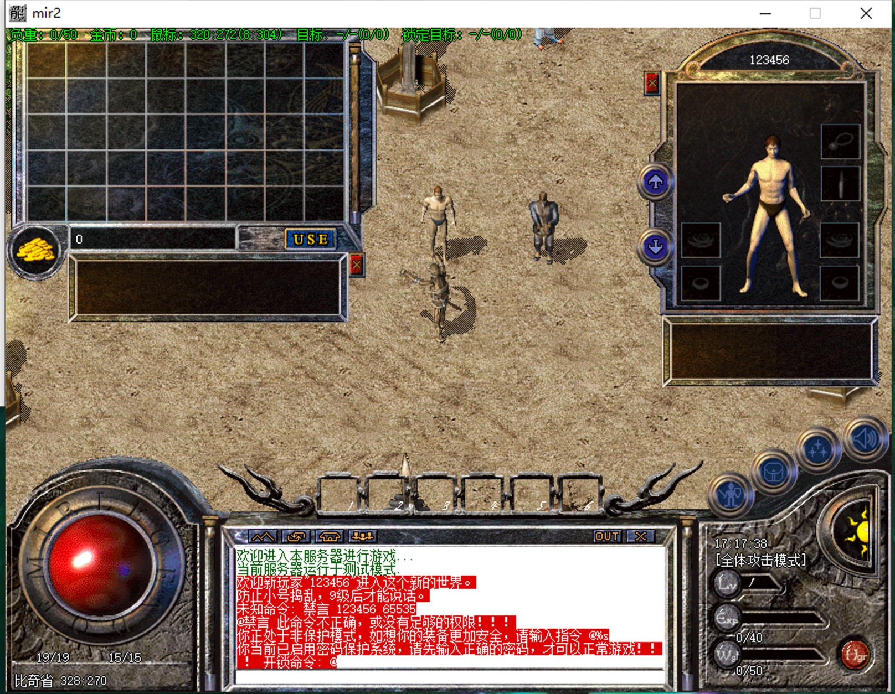
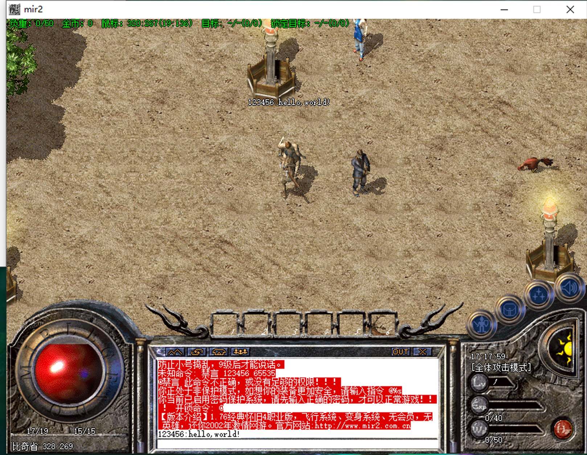
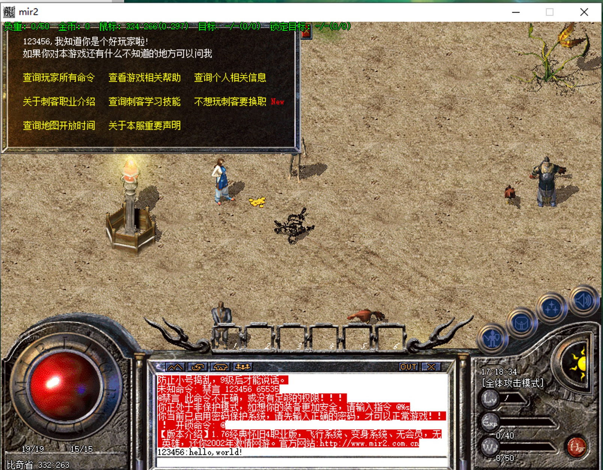

Legend of Mir 2 complete game server, support 1.10-1.76 classic game functions, support online and multiplayer interaction.

This project refers to the network Delphi code, which can be used with the original 1.76 source code of Legend of Blood for game experience. If you have any questions or problems, please submit Issues.  

### How to use    
## Client
>  You can build the game client yourself from the Delphi source code or use the game client files we provide.    
* How to download the Delphi game client  
    * Please use the search engine to search for blood legend source code yourself.  
* Use our game client  
    * download here (later, we are ready)  

## Server
> You can download various game versions on the search engine or download our basic version to experience.   
* download here (later, we are ready)

## Startup sequence and project description. 
1. DBSvr (database service, responsible for data storage). 
2. LoginSvr (account login service, responsible for account registration, login, server selection, etc.). 
3. GameSvr (game data engine, responsible for game data processing interaction, spell casting, walking, etc.). 
4. GameGate (game gateway, responsible for sending player data to the game engine, the data interacted by players are all in this service and then forwarded to the data engine for processing). 
5. SelGate (role gateway, responsible for role query, new creation, deletion, etc., and finally processed by DBSvr, the service will not be able to obtain character data after the client logs in if the service is not activated). 
6. LoginGate (login gateway, responsible for forwarding the login data to LoginSvr for processing, the service does not start the client and cannot connect to the game). 

### Images

